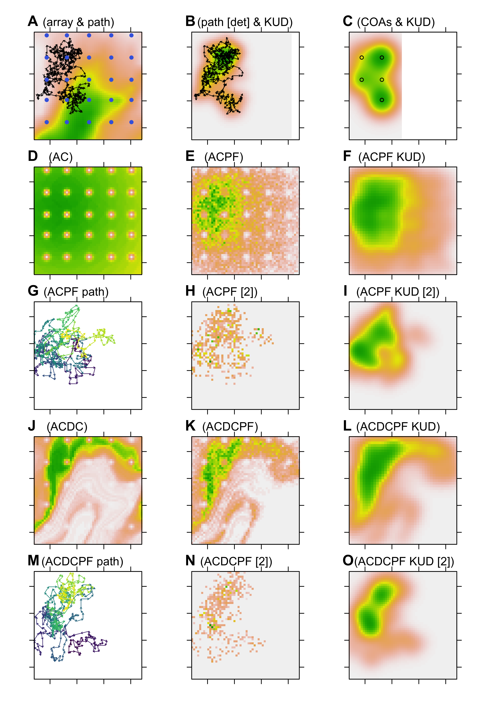

<!-- README.md is generated from README.Rmd. Please edit that file -->

```{r, include = FALSE}
knitr::opts_chunk$set(
  collapse = TRUE,
  comment = "#>"
)
```

^1^ Scottish Oceans Institute, University of St Andrews, University of St Andrews, Scotland  
^2^ Centre for Research into Ecological and Environmental Modelling University of St Andrews, Scotland

^\*^ This repository is maintained by Edward Lavender (el72@st-andrews.ac.uk).

[](https://www.repostatus.org/#active)

## Introduction

The `flapper` family of algorithms is a new suite of mechanistic approaches designed to reconstruct patterns of space use and movement from discrete detections in passive acoustic telemetry arrays. This repository illustrates the applications of these algorithms using simulated datasets. The performance of alternative methods is compared in terms of how well they recover simulated patterns of space use under different circumstances (e.g., passive acoustic telemetry array designs). 

## Prerequisites

Simulations and analyses are written in `R` and organised as an `R Project`. For data simulation, processing and analysis, the [`flapper`](https://github.com/edwardlavender/flapper) `R` package is required. For visualisation, [`prettyGraphics`](https://github.com/edwardlavender/prettyGraphics) is used, which is a dependency in [`flapper`](https://github.com/edwardlavender/flapper). For quick data summaries, the [`utils.add`](https://github.com/edwardlavender/utils.add) package is used on a few occasions.

## Structure

1. `R` contains scripts for data simulation and analysis. 
    
    * `sim_data` simulates data for analysis:
        * Array designs are simulated using `flapper::sim_array()`;
        * Movement paths are simulated using `flapper::sim_path_sa()`;
        * For each movement path and array design, observations arising from movement---namely, detections at receivers---are simulated via `flapper::sim_detections()`;
        * A directory system within `data` (see below) in which to store the results from the analyses of these simulated data is also set up;
        
    * `sim_analyse` analyses the simulated movement path(s) and methods for examining emergent patterns of space use. 
        
    * `sim_workhorse` provides methods for implementing the `flapper` family of algorithms to simulated data.
    
    * `sim_implement` is a wrapper that, for each simulated movement path and array design, implements `sim_workhorse` to generate outputs. 
    
    * `sim_illustrate` illustrates the main outputs of the `flapper` family of algorithms. 
    
    * `sim_synthesise` synthesises the main results of applying the `flapper` family of algorithms to reconstruct patterns of space use for different array designs. 
    
    * `sim_wall_time` calculates the wall time for all simulations. 

2. `data` contains data for the project. 

3. `fig` contains figures. 

Note that `data` and `fig` are not included in the online version of this repository. 

## Workflow 

1. Run `sim_data` to simulate datasets, customising the array designs and movement path parameters as necessary*. 

2. Examine methods for inferring patterns of space use for the simulated movement path(s) via `sim_analyse`. 

3. Implement algorithms for a specific movement path and array combination via `sim_workhorse` or for all movement paths and array designs via `sim_implement`*. Note that for the former, the movement path and array ID need to be specified at the top of the script.

4. Examine and synthesise outputs via `sim_illustrate`, `sim_synthesise` and `sim_wall_time`. 

3. Examine outputs in `data` and `fig`, such as the example figure below. 

*For the first implementation of this project, ensure that all sections that create data are set to TRUE rather than FALSE (in which case previously created files are loaded and used for analysis). 



_Figure 1. A comparison of methods for reconstructing simulated patterns of movement and space use, derived from an application of the `flapper_sim` project._

## Packages

This repository uses a number of non-default packages, available from [The Comprehensive R Archive Network](https://cran.r-project.org). These can be installed with `install.packages()`. Three packages that are only available on [GitHub](https://github.com/) are also used:

* [`flapper`](https://github.com/edwardlavender/flapper). This package provides tools for the simulation, processing and analysis of passive acoustic telemetry data, including the `flapper` family of algorithms. 
* [`prettyGraphics`](https://github.com/edwardlavender/prettyGraphics). This package is used for plotting. 
* [`utils.add`](https://github.com/edwardlavender/utils.add). The `utils.add::basic_stats()` function is sometimes used as a convenient routine for summarising data. This could be replaced by base `R` functions, such as `summary()`. 

## Citation

Lavender et al. (in prep). A new family of algorithms for inferring movement paths and patterns of space use from discrete detections in acoustic arrays. 

