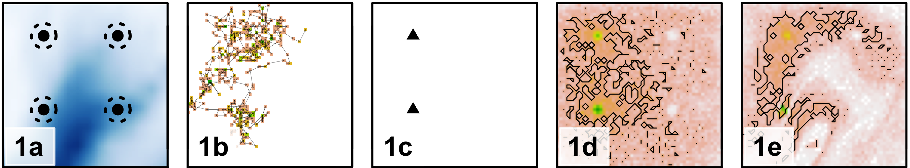
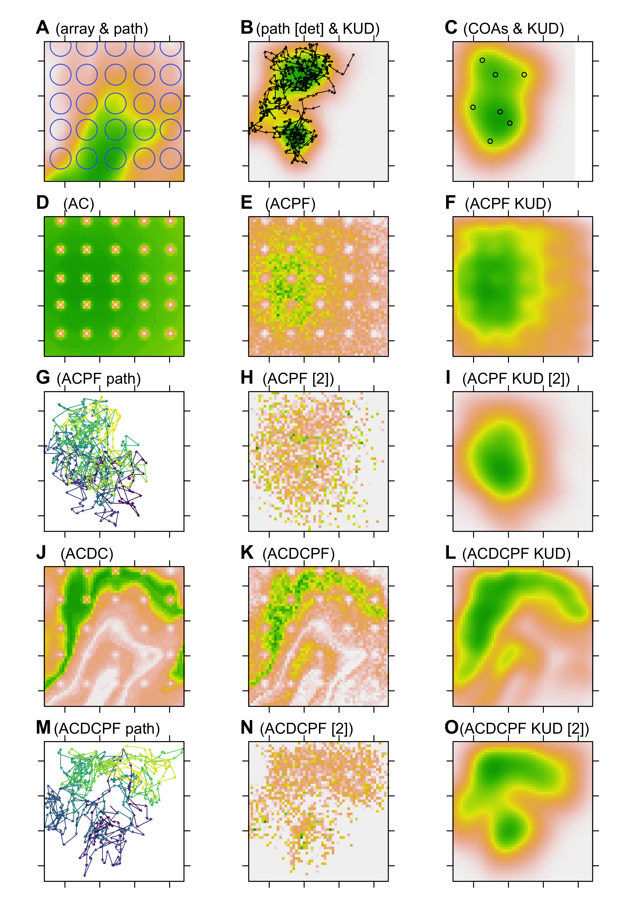

<!-- README.md is generated from README.Rmd. Please edit that file -->

```{r, include = FALSE}
knitr::opts_chunk$set(
  collapse = TRUE,
  comment = "#>"
)
```

^1^ Scottish Oceans Institute, University of St Andrews, Scotland  
^2^ Centre for Research into Ecological and Environmental Modelling, University of St Andrews, Scotland

^\*^ This repository is maintained by Edward Lavender (el72@st-andrews.ac.uk).

[](https://www.repostatus.org/#inactive) [](https://zenodo.org/badge/latestdoi/401989836)

## Introduction

The `flapper` family of algorithms is a suite of mechanistic approaches designed to reconstruct fine-scale movement paths and emergent patterns of space use from discrete detections in passive acoustic telemetry arrays. This repository illustrates applications of these algorithms using simulated datasets. The performance and sensitivity of alternative methods is compared in terms of how well they recover simulated patterns of space use under different circumstances (e.g., passive acoustic telemetry array designs). 



_Figure 1. Example outputs of the `flapper_sim` project showing a simulated array and movement path alongside patterns of space use reconstructed by different algorithms._

## Prerequisites

Simulations and analyses are written in `R` and organised as an `RStudio Project` with `{renv}`. For data simulation, processing and analysis, the [`flapper`](https://github.com/edwardlavender/flapper) `R` package is required. For visualisation, [`prettyGraphics`](https://github.com/edwardlavender/prettyGraphics) is used, which is a dependency in [`flapper`](https://github.com/edwardlavender/flapper). For quick data summaries, the [`utils.add`](https://github.com/edwardlavender/utils.add) package is used on a few occasions.

## Structure

1. `R/` contains scripts for data simulation and analysis. 
    
    * `helper.R` contains set up code and defines helper functions.
    
    * `sim_data.R` simulates data for analysis:
        * Array designs are simulated using `flapper::sim_array()`;
        * Movement paths are simulated using `flapper::sim_path_sa()`;
        * For each movement path and array design, observations arising from movement---namely, detections at receivers---are simulated via `flapper::sim_detections()`;
        * A directory system within `data` (see below), within which results from the analyses of these simulated data are stored, is also set up;
        
    * `sim_workhorse.R` provides methods for implementing the `flapper` family of algorithms to simulated data (using both 'correct' and 'mis-specified' parameters).
    
    * `sim_implement.R` is a wrapper that, for each simulated movement path, array design and set of algorithm parameters, implements `sim_workhorse` to generate outputs. 
    
    * `sim_illustrate.R` illustrates the main outputs of the `flapper` family of algorithms. 
    
    * `sim_evaluate.R` and `sim_evaluate_spatstat.R` evaluate the performance of the `flapper` family of algorithms, when applied 'correctly', in different array designs and `sim_evaluate_wall_time.R` calculates the wall time for the simulations. 
    
    * `sim_sensitivity.R` examines the sensitivity of the `flapper` algorithms applied using different parameter 'estimates'. 

2. `data/` contains data for the project. 

3. `fig/` contains figures. 

Note that `data/` and `fig/` are not included in the online version of this repository. 

## Workflow 

1. Open the `RStudio Project` and use `{renv}` to restore the local project library. 

2. Run `sim_data.R` to simulate datasets, customising the array designs and movement path parameters as necessary*. 

3. Implement algorithms for a specific movement path, array and parameter set via `sim_workhorse.R` or for all movement paths, array designs and parameter sets via `sim_implement.R`*. Note that for the former, the movement path, array ID and parameter set need to be specified at the top of the script.

4. Evaluate algorithm outputs when applied 'correctly' via `sim_illustrate.R`, `sim_evaluate.R`, `sim_evaluate_spatstat.R` and `sim_evaluate_wall_time.R`. 

5. Examine algorithm sensitivity via `sim_sensitivity.R`. 

6. Examine outputs in `data/` and `fig/`, such as the example figure below. 

*For the first implementation of this project, ensure that all sections that create data are set to `TRUE` rather than `FALSE` (in which case previously created files are loaded and used for analysis). 



_Figure 2. An example comparison of methods for reconstructing simulated patterns of movement and space use, derived from an application of the `flapper_sim` project._

## Packages

This repository uses a number of non-default packages, available from [The Comprehensive R Archive Network](https://cran.r-project.org). These can be installed with `install.packages()`. Three packages that are only available on [GitHub](https://github.com/) are also used:

* [`flapper`](https://github.com/edwardlavender/flapper). This package provides tools for the simulation, processing and analysis of passive acoustic telemetry data, including the `flapper` family of algorithms. 
* [`prettyGraphics`](https://github.com/edwardlavender/prettyGraphics). This package is used for plotting. 
* [`utils.add`](https://github.com/edwardlavender/utils.add). The `utils.add::basic_stats()` function is sometimes used as a convenient routine for summarising data. This could be replaced by base `R` functions, such as `summary()`. 

## Citation

Lavender et al. (in press). A semi-stochastic modelling framework for passive acoustic telemetry. Methods in Ecology and Evolution.  

